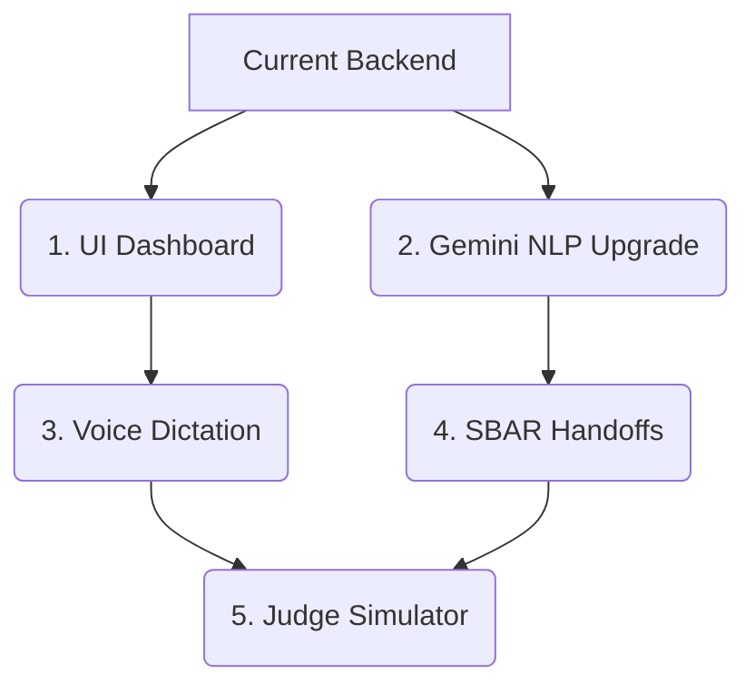

# MediStream: Hackathon Roadmap & Gemini Integration Specification

This document provides both the **Strategic Roadmap** to build a winning hackathon project and the **Detailed Technical Specification** (prompts, schemas, and outcomes) for migrating MediStream to Gemini.

---

## Part 1: Strategic Roadmap (Winning the Hackathon)

To impress judges and address real-world hospital workflows, we propose moving from a backend API prototype to a comprehensive **Clinical Control Center**.

### A. Feature Matrix

| Feature | The Hackathon/Market Problem | The Winning Solution |
| :--- | :--- | :--- |
| **User Interface** | Judges cannot easily "see" or interact with a backend API. | **Glassmorphic Clinical Dashboard**: A beautiful, real-time frontend showing active tasks, a live risk-gauge, and system logs. |
| **NLP Engine** | Local DistilBERT is missing from the repo, heavy, and fails on complex phrasing. | **Gemini-Powered Structured Extraction**: Use Gemini structured JSON outputs for intent classification and entity extraction. Highly robust and zero local setup. |
| **Input Method** | In busy wards, doctors do not have time to type. | **Voice Command Dictation**: A microphone button in the dashboard to let doctors dictate commands, which are converted to text and parsed. |
| **Handoff Quality** | Generic 3-sentence summaries lack clinical utility. | **SBAR (Situation-Background-Assessment-Recommendation) Summaries**: Format shift handoffs using the standard medical SBAR protocol. |
| **Judge Testing** | Judges won't run python command-line scripts. | **One-Click Simulator Panel**: A sidebar with pre-set medical scenarios that instantly demonstrate voice, task creation, risk escalation, and shift end. |

### B. Implementation Flow


---

## Part 2: Technical Specification (Gemini NLP & Summary Engines)

This section outlines the exact prompts, Pydantic schemas, and expected outcomes for our Gemini-powered services.

### 1. Gemini NLP Parsing Engine (Real-time Chat Processing)

#### A. System Prompt & Instructions
The model is configured with the following instruction set:

```text
You are an expert clinical operations parser. Your job is to parse conversational text from medical staff and extract structured operational signals.

Classify the text into one of these intents:
1. CREATE_TASK: Staff member assigns a task to a user (e.g., "@NurseNeha please check bed 4").
2. COMPLETE_TASK: Staff member reports a task code is finished (e.g., "T-102 is completed").
3. BLOCK_TASK: Staff member reports a task is blocked by an obstacle (e.g., "T-204 blocked because lab results are missing").
4. ALERT: Staff member reports an emergency (e.g., "Code blue in room 4" or "Need crash cart immediately").
5. OTHER: For messages that do not contain operational instructions (e.g., "Thanks!", "Got it").

Determine Priority:
- CRITICAL: Emergency alerts, cardiac arrest, patient coding.
- HIGH: Urgent tasks, immediate medications, significant blockers.
- MEDIUM: Standard checks, reports, routine care.
- LOW: Non-time-critical admin tasks, cleaning.

Extract Entities:
- assigned_to: The username mentioned after '@' (e.g. from '@NurseNeha' extract 'NurseNeha').
- task_code: The task number in the format 'T-XXXX' (e.g. 'T-1023').
- title: The content/title of the task to create.
- block_reason: The reason why a task is blocked (usually following 'because' or 'due to').
- alert_message: The emergency warning message.

Provide a confidence score between 0.0 and 1.0 representing your classification certainty.
```

#### B. Response Schema (Pydantic Model)
Gemini is instructed to respond strictly in this JSON structure:

```python
from pydantic import BaseModel, Field
from typing import Optional, Literal

class NLPEntities(BaseModel):
    assigned_to: Optional[str] = Field(None, description="Username of assignee from mention, without '@'")
    task_code: Optional[str] = Field(None, description="Task code identifier (e.g., 'T-1023')")
    title: Optional[str] = Field(None, description="Cleaned title of the task being created")
    block_reason: Optional[str] = Field(None, description="Reason for blocking the task")
    alert_message: Optional[str] = Field(None, description="Emergency description text")

class NLPResult(BaseModel):
    intent: Literal["CREATE_TASK", "COMPLETE_TASK", "BLOCK_TASK", "ALERT", "OTHER"]
    confidence: float = Field(..., ge=0.0, le=1.0)
    priority: Literal["LOW", "MEDIUM", "HIGH", "CRITICAL"]
    entities: NLPEntities
```

#### C. Scenario Inputs and Expected JSON Outcomes

##### Scenario 1: Task Creation
*   **Input Message**: `"@NurseNeha please prepare discharge summary for bed 42 immediately"`
*   **Outcome JSON**:
    ```json
    {
      "intent": "CREATE_TASK",
      "confidence": 0.98,
      "priority": "HIGH",
      "entities": {
        "assigned_to": "NurseNeha",
        "task_code": null,
        "title": "Prepare discharge summary for bed 42 immediately",
        "block_reason": null,
        "alert_message": null
      }
    }
    ```

##### Scenario 2: Blocking a Task
*   **Input Message**: `"T-501 is blocked because patient is dizzy and blood pressure is dropping"`
*   **Outcome JSON**:
    ```json
    {
      "intent": "BLOCK_TASK",
      "confidence": 0.99,
      "priority": "HIGH",
      "entities": {
        "assigned_to": null,
        "task_code": "T-501",
        "title": null,
        "block_reason": "patient is dizzy and blood pressure is dropping",
        "alert_message": null
      }
    }
    ```

##### Scenario 3: Emergency Alert
*   **Input Message**: `"Patient coding in Room 402, need immediate crash cart!"`
*   **Outcome JSON**:
    ```json
    {
      "intent": "ALERT",
      "confidence": 1.0,
      "priority": "CRITICAL",
      "entities": {
        "assigned_to": null,
        "task_code": null,
        "title": null,
        "block_reason": null,
        "alert_message": "Patient coding in Room 402, need immediate crash cart!"
      }
    }
    ```

---

## Part 2: Technical Specification (Gemini NLP & Summary Engines)

This section outlines the exact prompts, Pydantic schemas, and expected outcomes for our Gemini-powered services.

### 1. Gemini NLP Parsing Engine (Real-time Chat Processing)

#### A. System Prompt & Instructions
The model is configured with the following instruction set:

```text
You are an expert clinical operations parser. Your job is to parse conversational text from medical staff and extract structured operational signals.

Classify the text into one of these intents:
1. CREATE_TASK: Staff member assigns a task to a user (e.g., "@NurseNeha please check bed 4").
2. COMPLETE_TASK: Staff member reports a task code is finished (e.g., "T-102 is completed").
3. BLOCK_TASK: Staff member reports a task is blocked by an obstacle (e.g., "T-204 blocked because lab results are missing").
4. ALERT: Staff member reports an emergency (e.g., "Code blue in room 4" or "Need crash cart immediately").
5. OTHER: For messages that do not contain operational instructions (e.g., "Thanks!", "Got it").

Determine Priority:
- CRITICAL: Emergency alerts, cardiac arrest, patient coding.
- HIGH: Urgent tasks, immediate medications, significant blockers.
- MEDIUM: Standard checks, reports, routine care.
- LOW: Non-time-critical admin tasks, cleaning.

Extract Entities:
- assigned_to: The username mentioned after '@' (e.g. from '@NurseNeha' extract 'NurseNeha').
- task_code: The task number in the format 'T-XXXX' (e.g. 'T-1023').
- title: The content/title of the task to create.
- block_reason: The reason why a task is blocked (usually following 'because' or 'due to').
- alert_message: The emergency warning message.

Provide a confidence score between 0.0 and 1.0 representing your classification certainty.
```

#### B. Response Schema (Pydantic Model)
Gemini is instructed to respond strictly in this JSON structure:

```python
from pydantic import BaseModel, Field
from typing import Optional, Literal

class NLPEntities(BaseModel):
    assigned_to: Optional[str] = Field(None, description="Username of assignee from mention, without '@'")
    task_code: Optional[str] = Field(None, description="Task code identifier (e.g., 'T-1023')")
    title: Optional[str] = Field(None, description="Cleaned title of the task being created")
    block_reason: Optional[str] = Field(None, description="Reason for blocking the task")
    alert_message: Optional[str] = Field(None, description="Emergency description text")

class NLPResult(BaseModel):
    intent: Literal["CREATE_TASK", "COMPLETE_TASK", "BLOCK_TASK", "ALERT", "OTHER"]
    confidence: float = Field(..., ge=0.0, le=1.0)
    priority: Literal["LOW", "MEDIUM", "HIGH", "CRITICAL"]
    entities: NLPEntities
```

#### C. Scenario Inputs and Expected JSON Outcomes

##### Scenario 1: Task Creation
*   **Input Message**: `"@NurseNeha please prepare discharge summary for bed 42 immediately"`
*   **Outcome JSON**:
    ```json
    {
      "intent": "CREATE_TASK",
      "confidence": 0.98,
      "priority": "HIGH",
      "entities": {
        "assigned_to": "NurseNeha",
        "task_code": null,
        "title": "Prepare discharge summary for bed 42 immediately",
        "block_reason": null,
        "alert_message": null
      }
    }
    ```

##### Scenario 2: Blocking a Task
*   **Input Message**: `"T-501 is blocked because patient is dizzy and blood pressure is dropping"`
*   **Outcome JSON**:
    ```json
    {
      "intent": "BLOCK_TASK",
      "confidence": 0.99,
      "priority": "HIGH",
      "entities": {
        "assigned_to": null,
        "task_code": "T-501",
        "title": null,
        "block_reason": "patient is dizzy and blood pressure is dropping",
        "alert_message": null
      }
    }
    ```

##### Scenario 3: Emergency Alert
*   **Input Message**: `"Patient coding in Room 402, need immediate crash cart!"`
*   **Outcome JSON**:
    ```json
    {
      "intent": "ALERT",
      "confidence": 1.0,
      "priority": "CRITICAL",
      "entities": {
        "assigned_to": null,
        "task_code": null,
        "title": null,
        "block_reason": null,
        "alert_message": "Patient coding in Room 402, need immediate crash cart!"
      }
    }
    ```

---

## Part 2: Technical Specification (Gemini NLP & Summary Engines)

This section outlines the exact prompts, Pydantic schemas, and expected outcomes for our Gemini-powered services.

### 1. Gemini NLP Parsing Engine (Real-time Chat Processing)

#### A. System Prompt & Instructions
The model is configured with the following instruction set:

```text
You are an expert clinical operations parser. Your job is to parse conversational text from medical staff and extract structured operational signals.

Classify the text into one of these intents:
1. CREATE_TASK: Staff member assigns a task to a user (e.g., "@NurseNeha please check bed 4").
2. COMPLETE_TASK: Staff member reports a task code is finished (e.g., "T-102 is completed").
3. BLOCK_TASK: Staff member reports a task is blocked by an obstacle (e.g., "T-204 blocked because lab results are missing").
4. ALERT: Staff member reports an emergency (e.g., "Code blue in room 4" or "Need crash cart immediately").
5. OTHER: For messages that do not contain operational instructions (e.g., "Thanks!", "Got it").

Determine Priority:
- CRITICAL: Emergency alerts, cardiac arrest, patient coding.
- HIGH: Urgent tasks, immediate medications, significant blockers.
- MEDIUM: Standard checks, reports, routine care.
- LOW: Non-time-critical admin tasks, cleaning.

Extract Entities:
- assigned_to: The username mentioned after '@' (e.g. from '@NurseNeha' extract 'NurseNeha').
- task_code: The task number in the format 'T-XXXX' (e.g. 'T-1023').
- title: The content/title of the task to create.
- block_reason: The reason why a task is blocked (usually following 'because' or 'due to').
- alert_message: The emergency warning message.

Provide a confidence score between 0.0 and 1.0 representing your classification certainty.
```

#### B. Response Schema (Pydantic Model)
Gemini is instructed to respond strictly in this JSON structure:

```python
from pydantic import BaseModel, Field
from typing import Optional, Literal

class NLPEntities(BaseModel):
    assigned_to: Optional[str] = Field(None, description="Username of assignee from mention, without '@'")
    task_code: Optional[str] = Field(None, description="Task code identifier (e.g., 'T-1023')")
    title: Optional[str] = Field(None, description="Cleaned title of the task being created")
    block_reason: Optional[str] = Field(None, description="Reason for blocking the task")
    alert_message: Optional[str] = Field(None, description="Emergency description text")

class NLPResult(BaseModel):
    intent: Literal["CREATE_TASK", "COMPLETE_TASK", "BLOCK_TASK", "ALERT", "OTHER"]
    confidence: float = Field(..., ge=0.0, le=1.0)
    priority: Literal["LOW", "MEDIUM", "HIGH", "CRITICAL"]
    entities: NLPEntities
```

#### C. Scenario Inputs and Expected JSON Outcomes

##### Scenario 1: Task Creation
*   **Input Message**: `"@NurseNeha please prepare discharge summary for bed 42 immediately"`
*   **Outcome JSON**:
    ```json
    {
      "intent": "CREATE_TASK",
      "confidence": 0.98,
      "priority": "HIGH",
      "entities": {
        "assigned_to": "NurseNeha",
        "task_code": null,
        "title": "Prepare discharge summary for bed 42 immediately",
        "block_reason": null,
        "alert_message": null
      }
    }
    ```

##### Scenario 2: Blocking a Task
*   **Input Message**: `"T-501 is blocked because patient is dizzy and blood pressure is dropping"`
*   **Outcome JSON**:
    ```json
    {
      "intent": "BLOCK_TASK",
      "confidence": 0.99,
      "priority": "HIGH",
      "entities": {
        "assigned_to": null,
        "task_code": "T-501",
        "title": null,
        "block_reason": "patient is dizzy and blood pressure is dropping",
        "alert_message": null
      }
    }
    ```

##### Scenario 3: Emergency Alert
*   **Input Message**: `"Patient coding in Room 402, need immediate crash cart!"`
*   **Outcome JSON**:
    ```json
    {
      "intent": "ALERT",
      "confidence": 1.0,
      "priority": "CRITICAL",
      "entities": {
        "assigned_to": null,
        "task_code": null,
        "title": null,
        "block_reason": null,
        "alert_message": "Patient coding in Room 402, need immediate crash cart!"
      }
    }
    ```

---

## Part 2: Technical Specification (Gemini NLP & Summary Engines)

This section outlines the exact prompts, Pydantic schemas, and expected outcomes for our Gemini-powered services.

### 1. Gemini NLP Parsing Engine (Real-time Chat Processing)

#### A. System Prompt & Instructions
The model is configured with the following instruction set:

```text
You are an expert clinical operations parser. Your job is to parse conversational text from medical staff and extract structured operational signals.

Classify the text into one of these intents:
1. CREATE_TASK: Staff member assigns a task to a user (e.g., "@NurseNeha please check bed 4").
2. COMPLETE_TASK: Staff member reports a task code is finished (e.g., "T-102 is completed").
3. BLOCK_TASK: Staff member reports a task is blocked by an obstacle (e.g., "T-204 blocked because lab results are missing").
4. ALERT: Staff member reports an emergency (e.g., "Code blue in room 4" or "Need crash cart immediately").
5. OTHER: For messages that do not contain operational instructions (e.g., "Thanks!", "Got it").

Determine Priority:
- CRITICAL: Emergency alerts, cardiac arrest, patient coding.
- HIGH: Urgent tasks, immediate medications, significant blockers.
- MEDIUM: Standard checks, reports, routine care.
- LOW: Non-time-critical admin tasks, cleaning.

Extract Entities:
- assigned_to: The username mentioned after '@' (e.g. from '@NurseNeha' extract 'NurseNeha').
- task_code: The task number in the format 'T-XXXX' (e.g. 'T-1023').
- title: The content/title of the task to create.
- block_reason: The reason why a task is blocked (usually following 'because' or 'due to').
- alert_message: The emergency warning message.

Provide a confidence score between 0.0 and 1.0 representing your classification certainty.
```

#### B. Response Schema (Pydantic Model)
Gemini is instructed to respond strictly in this JSON structure:

```python
from pydantic import BaseModel, Field
from typing import Optional, Literal

class NLPEntities(BaseModel):
    assigned_to: Optional[str] = Field(None, description="Username of assignee from mention, without '@'")
    task_code: Optional[str] = Field(None, description="Task code identifier (e.g., 'T-1023')")
    title: Optional[str] = Field(None, description="Cleaned title of the task being created")
    block_reason: Optional[str] = Field(None, description="Reason for blocking the task")
    alert_message: Optional[str] = Field(None, description="Emergency description text")

class NLPResult(BaseModel):
    intent: Literal["CREATE_TASK", "COMPLETE_TASK", "BLOCK_TASK", "ALERT", "OTHER"]
    confidence: float = Field(..., ge=0.0, le=1.0)
    priority: Literal["LOW", "MEDIUM", "HIGH", "CRITICAL"]
    entities: NLPEntities
```

#### C. Scenario Inputs and Expected JSON Outcomes

##### Scenario 1: Task Creation
*   **Input Message**: `"@NurseNeha please prepare discharge summary for bed 42 immediately"`
*   **Outcome JSON**:
    ```json
    {
      "intent": "CREATE_TASK",
      "confidence": 0.98,
      "priority": "HIGH",
      "entities": {
        "assigned_to": "NurseNeha",
        "task_code": null,
        "title": "Prepare discharge summary for bed 42 immediately",
        "block_reason": null,
        "alert_message": null
      }
    }
    ```

##### Scenario 2: Blocking a Task
*   **Input Message**: `"T-501 is blocked because patient is dizzy and blood pressure is dropping"`
*   **Outcome JSON**:
    ```json
    {
      "intent": "BLOCK_TASK",
      "confidence": 0.99,
      "priority": "HIGH",
      "entities": {
        "assigned_to": null,
        "task_code": "T-501",
        "title": null,
        "block_reason": "patient is dizzy and blood pressure is dropping",
        "alert_message": null
      }
    }
    ```

##### Scenario 3: Emergency Alert
*   **Input Message**: `"Patient coding in Room 402, need immediate crash cart!"`
*   **Outcome JSON**:
    ```json
    {
      "intent": "ALERT",
      "confidence": 1.0,
      "priority": "CRITICAL",
      "entities": {
        "assigned_to": null,
        "task_code": null,
        "title": null,
        "block_reason": null,
        "alert_message": "Patient coding in Room 402, need immediate crash cart!"
      }
    }
    ```

---

### 2. Gemini Clinical Handoff (SBAR Summary Engine)

#### A. SBAR Prompt Template
```text
You are an expert clinical hospital supervisor. Generate a structured shift handoff report following the standard SBAR (Situation, Background, Assessment, Recommendation) communication protocol.

Use ONLY the following verified shift data. Do not make up facts or inject extra cases:
- Total Tasks Logged: {total_tasks}
- Completed Tasks: {completed_tasks}
- Blocked Tasks: {blocked_tasks}
- Pending Tasks: {pending_tasks}
- Active Alerts Raised: {alerts_count}
- Live Risk Score: {risk_score}/10

Strictly format the output as follows:
### SBAR Shift Handoff Report

**S (Situation):**
[1-2 sentences summarizing the current state of the ward, referencing active alerts and overall status]

**B (Background):**
[1-2 sentences on task volume, completed tasks, and pending work during this shift]

**A (Assessment):**
[1-2 sentences evaluating the operational risk level, noting why tasks are blocked or what the risk score implies]

**R (Recommendation):**
[1-2 concrete, action-oriented bullet points for the incoming shift team to prioritize first]
```

#### B. Expected Markdown Outcome

```markdown
### SBAR Shift Handoff Report

**S (Situation):**
The ward is currently experiencing high operational pressure with 2 active critical alerts. The shift concluded with a high risk level of 8/10.

**B (Background):**
A total of 15 tasks were managed during the shift; while 10 tasks were successfully completed, 3 remain blocked and 2 are pending handoff.

**A (Assessment):**
Operational safety is compromised by critical blockers and outstanding emergency alerts, pushing our live risk score to a warning threshold of 8/10.

**R (Recommendation):**
*   Immediately dispatch staff to resolve active emergency alerts in room 402.
*   Review and unblock tasks T-501 and T-503 (waiting on pharmacy medication delivery).
```
